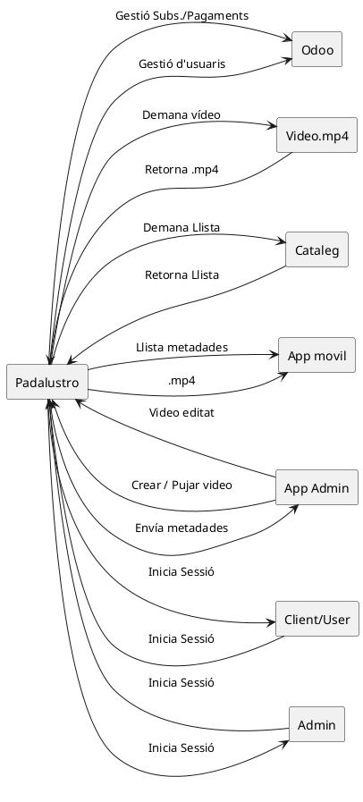

# Diagrama C4 Nivell 1

```plantuml
@startuml
left to right direction

rectangle "Padalustro" as MAIN


rectangle "Odoo" as Odoo
rectangle "Video.mp4" as Video
rectangle "Cataleg" as Cataleg
rectangle "App movil" as movil
rectangle "App Admin" as AppAdmi
rectangle "Client/User" as User
rectangle "Admin" as Admin


MAIN --> Odoo : Gestió Subs./Pagaments
MAIN --> Odoo : Gestió d'usuaris

MAIN --> Video : Demana vídeo
MAIN <-- Video : Retorna .mp4

MAIN --> Cataleg : Demana Llista
MAIN <-- Cataleg : Retorna Llista


MAIN --> movil : Llista metadades
MAIN --> movil : .mp4

MAIN <-- AppAdmi : Video editat
MAIN <-- AppAdmi : Crear / Pujar video
MAIN --> AppAdmi : Envía metadades

MAIN --> User : Inicia Sessió
MAIN <-- User : Inicia Sessió

MAIN <-- Admin : Inicia Sessió
MAIN --> Admin : Inicia Sessió

@enduml
```
