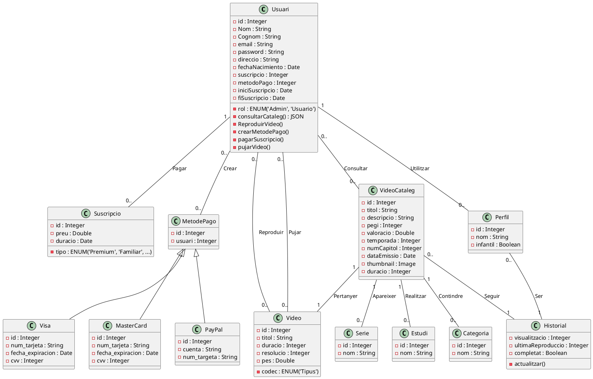

# Diagrama de Clases UML - Modelo de Datos (con visibilidad de atributos)

```plantuml
@startuml
class Usuari {
    - id : Integer
    - Nom : String
    - Cognom : String
    - rol : ENUM('Admin', 'Usuario')
    - email : String
    - password : String
    - direccio : String
    - fechaNacimiento : Date
    - suscripcio : Integer
    - metodoPago : Integer
    - iniciSuscripcio : Date
    - fiSuscripcio : Date
    - consultarCataleg() : JSON
    - ReproduirVideo()
    - crearMetodePago()
    - pagarSuscripcio()
    - pujarVideo()
}

class Suscripcio {
    - id : Integer
    - tipo : ENUM('Premium', 'Familiar', ...)
    - preu : Double
    - duracio : Date
}

class MetodePago {
    - id : Integer
    - usuari : Integer
}

class Visa {
    - id : Integer
    - num_tarjeta : String
    - fecha_expiracion : Date
    - cvv : Integer
}

class MasterCard {
    - id : Integer
    - num_tarjeta : String
    - fecha_expiracion : Date
    - cvv : Integer
}

class PayPal {
    - id : Integer
    - cuenta : String
    - num_targeta : String
}

class Video {
    - id : Integer
    - titol : String
    - duracio : Integer
    - codec : ENUM('Tipus')
    - resolucio : Integer
    - pes : Double
}

class Perfil {
    - id : Integer
    - nom : String
    - infantil : Boolean
}

class VideoCataleg {
    - id : Integer
    - titol : String
    - descripcio : String
    - pegi : Integer
    - valoracio : Double
    - temporada : Integer
    - numCapitol : Integer
    - dataEmissio : Date
    - thumbnail : Image
    - duracio : Integer
}

class Serie {
    - id : Integer
    - nom : String
}

class Estudi {
    - id : Integer
    - nom : String
}

class Categoria {
    - id : Integer
    - nom : String
}

class Historial {
    - visualitzacio : Integer
    - ultimaReproduccio : Integer
    - completat : Boolean
    - actualitzar()
}

' Relaciones
VideoCataleg "1" -- "0.." Serie : Apareixer
VideoCataleg "1" -- "1" Video : Pertanyer
VideoCataleg "1" -- "0.." Categoria : Contindre
VideoCataleg "1" -- "0.." Estudi : Realitzar
VideoCataleg "0.." -- "1" Historial : Seguir

Usuari "0.." -- "0.." Video : Reproduir
Usuari "1" -- "0.." Perfil : Utilitzar
Usuari "1" -- "0.." Suscripcio : Pagar
Usuari "0.." -- "0.." MetodePago : Crear
Usuari "0.." -- "0.." Video : Pujar
Usuari "0.." -- "0.." VideoCataleg : Consultar

Perfil "0.." -- "1" Historial : Ser

' Herencia
MetodePago <|-- Visa
MetodePago <|-- MasterCard
MetodePago <|-- PayPal

@enduml
```
