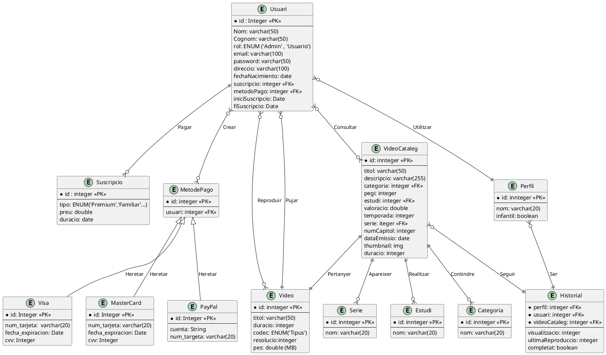

# Diagrama Modelo Datos

```plantuml
@startuml

entity Usuari {
    *id : Integer <<PK>>
    ---
    Nom: varchar(50)
    Cognom: varchar(50)
    rol: ENUM ('Admin' , 'Usuario')
    email: varchar(100)
    password: varchar(50)
    direccio: varchar(100)
    fechaNacimiento: date
    suscripcio: integer <<FK>>
    metodoPago: integer <<FK>>
    iniciSuscripcio: Date
    fiSuscripcio: Date
}

entity Suscripcio {
    *id : integer <<PK>>
    ---
    tipo: ENUM('Premium','Familiar'...)
    preu: double
    duracio: date
}

entity MetodePago {
    *id: integer <<PK>>
    ---
    usuari: integer <<FK>>
}

entity Visa {
  *id: Integer <<PK>>
  --
  num_tarjeta:  varchar(20)
  fecha_expiracion: Date
  cvv: Integer
}

entity MasterCard {
  *id: Integer <<PK>>
  --
  num_tarjeta: varchar(20)
  fecha_expiracion: Date
  cvv: Integer
}

entity PayPal {
  *id: Integer <<PK>>
  --
  cuenta: String
  num_targeta: varchar(20)
}

entity Video {
    *id: innteger <<PK>>
    ---
    titol: varchar(50)
    duracio: integer
    codec: ENUM('Tipus') 
    resolucio:integer
    pes: double (MB)
}

entity Perfil {
    *id: innteger <<PK>>
    ---
    nom: varchar(20)
    infantil: boolean
}

entity VideoCataleg {
    *id: innteger <<PK>>
    ---
    titol: varchar(50)
    descripcio: varchar(255)
    categoria: integer <<FK>>
    pegi: integer
    estudi: integer <<FK>>
    valoracio: double
    temporada: integer
    serie: iteger <<FK>>
    numCapitol: integer
    dataEmissio: date
    thumbnail: img
    duracio: integer
}

entity Serie{
    *id: innteger <<PK>>
    ---
    nom: varchar(20)    
}
entity Estudi{
    *id: innteger <<PK>>
    ---
    nom: varchar(20)    
}

entity Categoria{
    *id: innteger <<PK>>
    ---
    nom: varchar(20)
}

entity Historial {
    *perfil: integer <<FK>>
    *usuari: integer <<FK>>
    *videoCataleg: integer <<FK>>
    ---
    visualitzacio: integer
    ultimaReproduccio: integer
    completat: boolean
}

' Relacions

VideoCataleg ||--o{ Serie: Apareixer
VideoCataleg ||--|| Video: Pertanyer
VideoCataleg ||--o{ Categoria : Contindre
VideoCataleg ||--o{ Estudi : Realitzar
VideoCataleg }o--|| Historial: Seguir

Usuari }o--o{ Video : Reproduir
Usuari }o--|| Perfil : Utilitzar
Usuari ||--o{ Suscripcio : Pagar
Usuari }o--o{ MetodePago : Crear
Usuari }o--|| Video : Pujar
Usuari }o--o{ VideoCataleg : Consultar

Perfil }o--|| Historial: Ser

' Herencia
MetodePago <|-- Visa : Heretar
MetodePago <|-- MasterCard : Heretar
MetodePago <|-- PayPal : Heretar

@enduml
```
