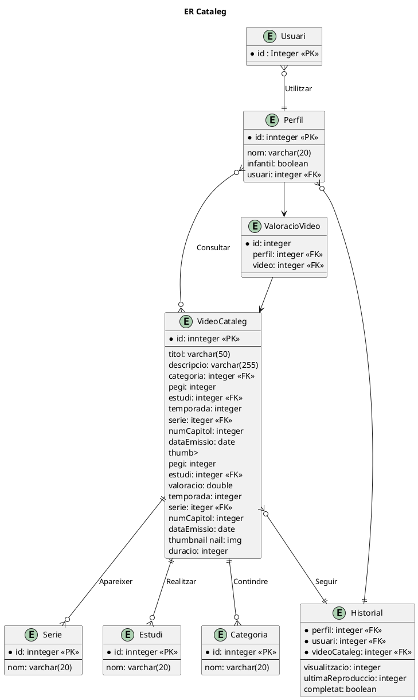

# ER Cataleg

```plantuml
@startuml

title ER Cataleg

entity VideoCataleg {
    *id: innteger <<PK>>
    ---
    titol: varchar(50)
    descripcio: varchar(255)
    categoria: integer <<FK>>
    pegi: integer
    estudi: integer <<FK>>
    temporada: integer
    serie: iteger <<FK>>
    numCapitol: integer
    dataEmissio: date
    thumb>
    pegi: integer
    estudi: integer <<FK>>
    valoracio: double
    temporada: integer
    serie: iteger <<FK>>
    numCapitol: integer
    dataEmissio: date
    thumbnail nail: img
    duracio: integer
}


entity ValoracioVideo{
    *id: integer
    perfil: integer <<FK>>
    video: integer <<FK>>
}

entity Serie{
    *id: innteger <<PK>>
    ---
    nom: varchar(20)    
}
entity Estudi{
    *id: innteger <<PK>>
    ---
    nom: varchar(20)    
}

entity Categoria{
    *id: innteger <<PK>>
    ---
    nom: varchar(20)
}

entity Historial {
    *perfil: integer <<FK>>
    *usuari: integer <<FK>>
    *videoCataleg: integer <<FK>>
    ---
    visualitzacio: integer
    ultimaReproduccio: integer
    completat: boolean
}
entity Usuari {
    *id : Integer <<PK>>
}

entity Perfil {
    *id: innteger <<PK>>
    ---
    nom: varchar(20)
    infantil: boolean
    usuari: integer <<FK>>
}

VideoCataleg ||--o{ Serie: Apareixer
VideoCataleg ||--o{ Categoria : Contindre
VideoCataleg ||--o{ Estudi : Realitzar
VideoCataleg }o--|| Historial: Seguir

Usuari }o--|| Perfil : Utilitzar
Perfil }o--o{ VideoCataleg : Consultar

Perfil }o--|| Historial
Perfil --> ValoracioVideo

ValoracioVideo --> VideoCataleg

@enduml
```
