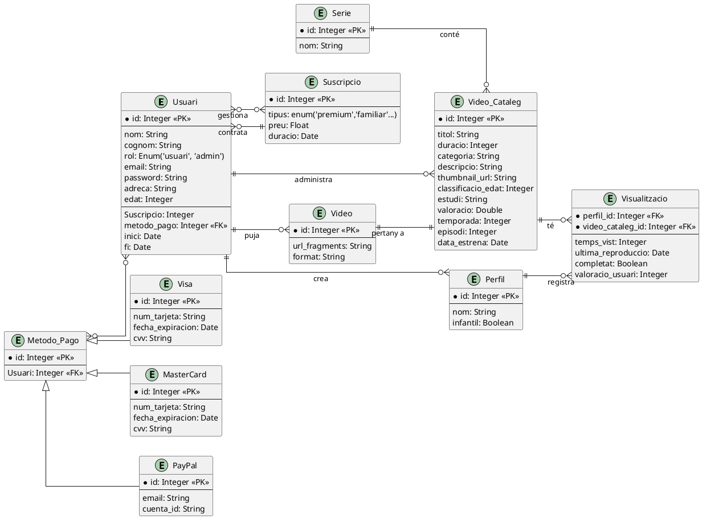

# Diagrama ER Conceptual

```plantuml

@startuml

left to right direction

skinparam linetype ortho

entity Usuari {
  *id: Integer <<PK>>
  --
  nom: String
  cognom: String
  rol: Enum('usuari', 'admin')
  email: String
  password: String
  adreca: String
  edat: Integer
  --
  Suscripcio: Integer 
  metodo_pago: Integer <<FK>>
  inici: Date
  fi: Date
}

entity Suscripcio {
  *id: Integer <<PK>>
  --
  tipus: enum('premium','familiar'...)
  preu: Float
  duracio: Date 
}

entity Perfil {
  *id: Integer <<PK>>
  --
  nom: String
  infantil: Boolean
}

entity Serie {
  *id: Integer <<PK>>
  --
  nom: String
}

entity Video_Cataleg {
  *id: Integer <<PK>>
  --
  titol: String
  duracio: Integer
  categoria: String
  descripcio: String
  thumbnail_url: String
  classificacio_edat: Integer
  estudi: String
  valoracio: Double
  temporada: Integer
  episodi: Integer
  data_estrena: Date
}

entity Video {
  *id: Integer <<PK>>
  --
  url_fragments: String
  format: String
}

entity Visualitzacio {
  *perfil_id: Integer <<FK>>
  *video_cataleg_id: Integer <<FK>>
  --
  temps_vist: Integer
  ultima_reproduccio: Date
  completat: Boolean
  valoracio_usuari: Integer
}

entity Metodo_Pago {
  *id: Integer <<PK>>
  --
  Usuari: Integer <<FK>>
}

entity Visa {
  *id: Integer <<PK>>
  --
  num_tarjeta: String
  fecha_expiracion: Date
  cvv: String
}

entity MasterCard {
  *id: Integer <<PK>>
  --
  num_tarjeta: String
  fecha_expiracion: Date
  cvv: String
}

entity PayPal {
  *id: Integer <<PK>>
  --
  email: String
  cuenta_id: String
}

' Relaciones
Usuari ||--o{ Perfil : "crea"
Usuari }o--|| Suscripcio : "contrata"
Usuari }o--o{ Suscripcio : "gestiona"
Usuari ||--o{ Video : "puja"
Usuari ||--o{ Video_Cataleg : "administra"
Video ||--|| Video_Cataleg : "pertany a"
Serie ||--o{ Video_Cataleg : "conté"
Perfil ||--o{ Visualitzacio : "registra"
Video_Cataleg ||--o{ Visualitzacio : "té"
Metodo_Pago }o--o{ Usuari

' Herencia (triángulo vacío)
Metodo_Pago <|-- Visa
Metodo_Pago <|-- MasterCard
Metodo_Pago <|-- PayPal

@enduml
```
