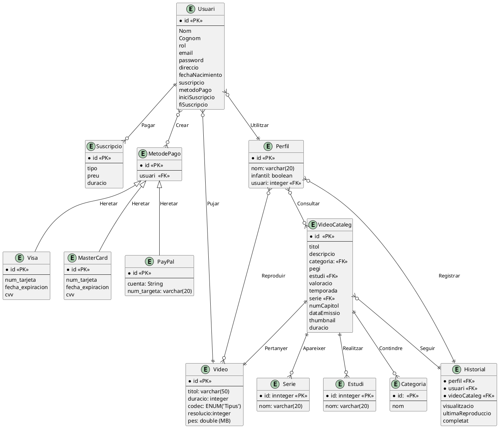

# Diagrama ER

```plantuml
@startuml

entity Usuari {
    *id <<PK>>
    ---
    Nom
    Cognom
    rol
    email
    password
    direccio
    fechaNacimiento
    suscripcio
    metodoPago
    iniciSuscripcio
    fiSuscripcio
}

entity Suscripcio {
    *id <<PK>>
    ---
    tipo
    preu
    duracio
}

entity MetodePago {
    *id <<PK>>
    ---
    usuari  <<FK>>
}

entity Visa {
  *id <<PK>>
  --
  num_tarjeta
  fecha_expiracion
  cvv
}

entity MasterCard {
  *id <<PK>>
  --
  num_tarjeta
  fecha_expiracion
  cvv
}

entity PayPal {
  *id <<PK>>
  --
  cuenta: String
  num_targeta: varchar(20)
}

entity Video {
    *id <<PK>>
    ---
    titol: varchar(50)
    duracio: integer
    codec: ENUM('Tipus') 
    resolucio:integer
    pes: double (MB)
}

entity Perfil {
    *id <<PK>>
    ---
    nom: varchar(20)
    infantil: boolean
    usuari: integer <<FK>>
}

entity VideoCataleg {
    *id  <<PK>>
    ---
    titol
    descripcio
    categoria: <<FK>>
    pegi 
    estudi <<FK>>
    valoracio
    temporada
    serie <<FK>>
    numCapitol
    dataEmissio
    thumbnail
    duracio
}

entity Serie{
    *id: innteger <<PK>>
    ---
    nom: varchar(20)    
}
entity Estudi{
    *id: innteger <<PK>>
    ---
    nom: varchar(20)    
}

entity Categoria{
    *id:  <<PK>>
    ---
    nom
}

entity Historial {
    *perfil <<FK>>
    *usuari <<FK>>
    *videoCataleg <<FK>>
    ---
    visualitzacio
    ultimaReproduccio
    completat
}

' Relacions

VideoCataleg ||--o{ Serie: Apareixer
VideoCataleg ||--|| Video: Pertanyer
VideoCataleg ||--o{ Categoria : Contindre
VideoCataleg ||--o{ Estudi : Realitzar
VideoCataleg }o--|| Historial: Seguir


Usuari }o--|| Perfil : Utilitzar
Usuari ||--o{ Suscripcio : Pagar
Usuari }o--o{ MetodePago : Crear
Usuari }o--|| Video : Pujar

Perfil }o--o{ VideoCataleg : Consultar
Perfil }o--o{ Video : Reproduir
Perfil }o--|| Historial : Registrar

' Herencia
MetodePago <|-- Visa : Heretar
MetodePago <|-- MasterCard : Heretar
MetodePago <|-- PayPal : Heretar

@enduml
```
