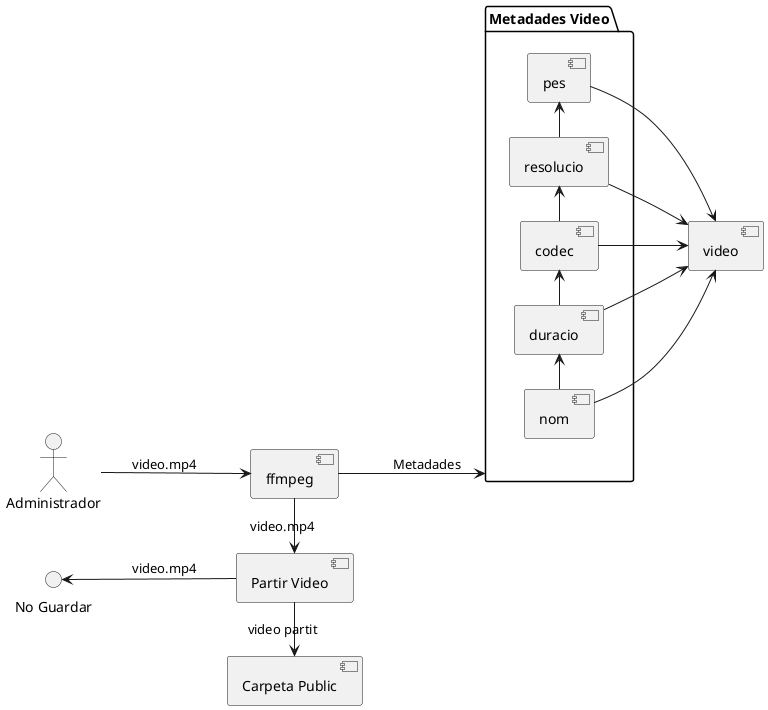

# Pipeline

```plantuml
@startuml
left to right direction
actor "Administrador" as admin
component "ffmpeg" as partir

package "Metadades Video" as MT{
    component "nom" as n
    component "duracio" as d
    component "codec" as c
    component "resolucio" as r
    component "pes" as p
}

component "video" as v


component "Partir Video" as VP
circle "No Guardar" as trash
component "Carpeta Public" as public


admin --> partir : video.mp4

partir --> MT : Metadades
n->d
d->c
c->r
r->p
n --> v
d --> v
c --> v
r --> v
p --> v

partir -> VP : video.mp4
VP -up-> trash : video.mp4
VP -> public: video partit

@enduml
```
