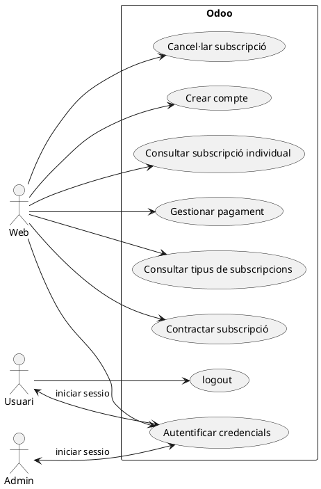

# UC ODOO Backend

```plantuml
@startuml
left to right direction

actor "Web" as WEB
rectangle "Odoo" {

  usecase "Crear compte" as UC1
  usecase "Autentificar credencials" as UC2
  usecase "Consultar subscripció individual" as UC3
  usecase "Gestionar pagament" as UC4
  usecase "Consultar tipus de subscripcions" as UC5
  usecase "Contractar subscripció" as UC6
  usecase "Cancel·lar subscripció" as UC7
  usecase "logout" as UC8

}

WEB --> UC1
WEB --> UC2
WEB --> UC3
WEB --> UC4
WEB --> UC5
WEB --> UC6
WEB --> UC7
UC2 <--> Usuari : iniciar sessio
Usuari --> UC8
Admin <--> UC2 : iniciar sessio


@enduml 
```
