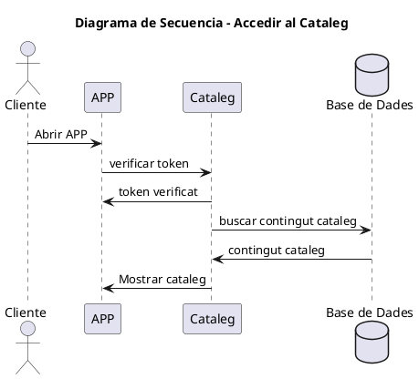

# Accedir al cataleg

```plantuml
@startuml AccedirCataleg
title Diagrama de Secuencia - Accedir al Cataleg
actor Cliente
participant "APP" as App
participant "Cataleg" as cat
database "Base de Dades" as DB

Cliente -> App: Abrir APP
App -> cat: verificar token
cat -> App : token verificat
cat -> DB: buscar contingut cataleg
DB -> cat: contingut cataleg
cat -> App: Mostrar cataleg
@enduml
```
