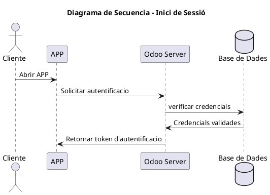

# Inici Sessio

```plantuml
@startuml IniciSessio
title Diagrama de Secuencia - Inici de Sessió
actor Cliente
participant "APP" as App
participant "Odoo Server" as Odoo
database "Base de Dades" as DB

Cliente -> App: Abrir APP
App -> Odoo: Solicitar autentificacio
Odoo -> DB : verificar credencials 
DB -> Odoo: Credencials validades
Odoo -> App: Retornar token d'autentificacio
@enduml
```
