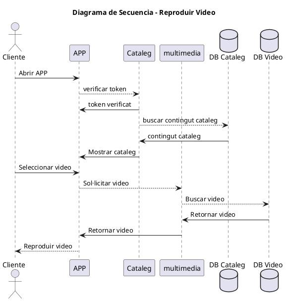

# Reproduir Video

```plantuml
@startuml ReproduirVideo
title Diagrama de Secuencia - Reproduir Video
actor Cliente
participant "APP" as App
participant "Cataleg" as cat
participant "multimedia" as vs
database "DB Cataleg" as DBC
database "DB Video" as DBV


Cliente -> App: Abrir APP
App --> cat: verificar token
cat -> App : token verificat
cat --> DBC: buscar contingut cataleg
DBC -> cat: contingut cataleg
cat -> App: Mostrar cataleg
Cliente -> App: Seleccionar video
App --> vs: Sol·licitar video
vs --> DBV: Buscar video
DBV -> vs : Retornar video
vs -> App: Retornar video
App --> Cliente: Reproduir video 

@enduml
```
